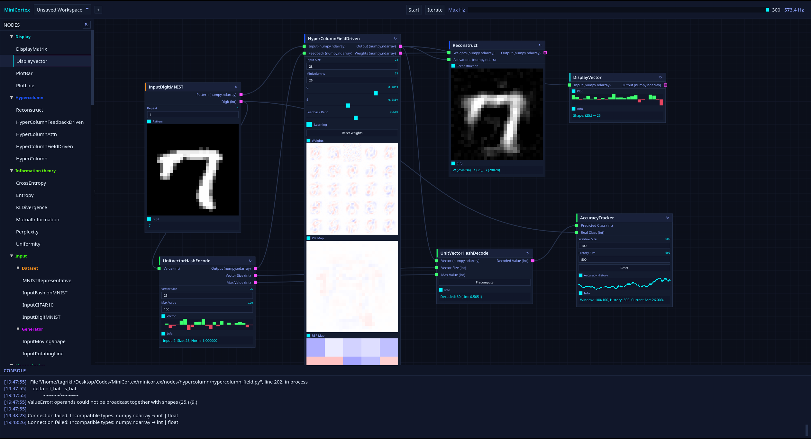

<p align="center">
  
</p>

<h1 align="center">MiniCortex</h1>

<p align="center">
  <strong>A node-based computational framework with a real-time visual editor</strong>
</p>

<p align="center">
  <em>Define modular computational units in Python, wire them together in the browser, and watch them run — live.</em>
</p>

---

## Overview

MiniCortex is a **node-based simulation framework** paired with a **real-time web-based visual editor**. It lets you define computational units as modular Python classes, connect them into directed graphs, execute them with topologically-ordered signal propagation, and observe their internal states updating live in the browser — all without writing any frontend code.

What defines MiniCortex:

- **Declarative node definition** — a Python descriptor API where inputs, outputs, properties, displays, actions, and persistent stores are declared as class attributes. No boilerplate; everything is accessed as `self.attribute_name`.
- **Live visual editor** — a browser-based canvas with drag-and-drop node composition, interactive property controls, and real-time 2D/1D array visualization rendered directly inside each node.
- **Topological execution engine** — a network runtime that sorts nodes by dependency (Kahn's algorithm), propagates signals in tick-based steps, and handles feedback cycles by using previous-tick values.
- **Hot-reloadable nodes** — mark a node with `@dynamic`, edit its Python source on disk, and reload it in the running editor. State is preserved, invalid connections are pruned, and `init()` is called fresh.
- **Workspace persistence** — save and load entire graph configurations (nodes, connections, state, viewport) as JSON files, enabling reproducible experiments and session continuity.

---

## Key Concepts

### Nodes

A **Node** is the fundamental computational unit. Each node defines:

| Concept | Description |
|---|---|
| **Input Ports** | Typed connection points that receive data from upstream nodes |
| **Output Ports** | Typed connection points that send data to downstream nodes |
| **Properties** | Interactive parameters (sliders, integers, checkboxes, radio buttons) adjustable from the UI |
| **Displays** | Visual outputs rendered inside the node (2D/1D arrays, numeric values, text) |
| **Actions** | Buttons that trigger callbacks on the node instance |
| **Stores** | Persistent internal state variables that survive workspace save/load and hot-reload |

Nodes are defined as Python classes inheriting from `Node`, using a **descriptor-based declarative API**:

```python
import numpy as np
from minicortex.core.node import Node
from minicortex.core.descriptors.ports import InputPort, OutputPort
from minicortex.core.descriptors.properties import Slider, Integer, CheckBox
from minicortex.core.descriptors.displays import Vector2D, Vector1D, Numeric, Text
from minicortex.core.descriptors.actions import Button
from minicortex.core.descriptors.store import Store
from minicortex.core.descriptors import node

@node.processing
class EdgeDetector(Node):
    """Applies a Sobel-like edge detection kernel to a 2D input."""

    # Ports — typed connection points
    input_image  = InputPort("Image", np.ndarray)
    output_edges = OutputPort("Edges", np.ndarray)

    # Properties — interactive controls in the UI
    threshold   = Slider("Threshold", 0.3, 0.0, 1.0)
    kernel_size = Integer("Kernel Size", default=3, min_val=3, max_val=7)
    invert      = CheckBox("Invert", default=False)

    # Displays — live visualizations rendered inside the node
    preview    = Vector2D("Preview", color_mode="grayscale")
    histogram  = Vector1D("Edge Histogram")
    edge_ratio = Numeric("Edge %", format=".1f")
    info       = Text("Status", default="Waiting for input")

    # Actions — buttons that call methods
    reset = Button("Reset Stats", callback="_on_reset")

    # Stores — persistent state that survives save/load and hot-reload
    frame_count = Store(default=0)

    def init(self):
        """Called once after registration."""
        self.frame_count = 0

    def process(self):
        """Called each network tick. Read inputs, compute, set outputs."""
        if self.input_image is None:
            return

        img = self.input_image.astype(np.float64)
        # Simple Sobel-like gradient magnitude
        gx = np.diff(img, axis=1, prepend=img[:, :1])
        gy = np.diff(img, axis=0, prepend=img[:1, :])
        magnitude = np.sqrt(gx**2 + gy**2)
        magnitude /= magnitude.max() + 1e-9

        # Apply threshold
        edges = (magnitude > float(self.threshold)).astype(np.float64)
        if self.invert:
            edges = 1.0 - edges

        self.frame_count += 1
        self.output_edges = edges
        self.preview = edges
        self.histogram = magnitude.mean(axis=0)
        self.edge_ratio = 100.0 * edges.mean()
        self.info = f"Frame {self.frame_count}"

    def _on_reset(self, params):
        self.frame_count = 0
        return {"status": "ok"}
```

All descriptor values are accessed directly as `self.attribute_name` — no boilerplate getters or setters.

### Node Categories

Nodes are organized into categories via decorators that auto-register them in the UI palette:

| Decorator | Category | Typical Use |
|---|---|---|
| `@node.input` | Input | Data sources, generators, dataset loaders |
| `@node.processing` | Processing | Algorithms, learning rules, cortical area models |
| `@node.utility` | Utilities | Transforms, displays, arithmetic operations |
| `@node.output` | Output | Data sinks, exporters |
| `@node.custom("Name")` | Custom | Any user-defined category |

### Network Execution

The **Network** engine processes the node graph using **Kahn's algorithm** for topological sorting, ensuring that:

- **Feedforward** inputs are always fresh (computed in the current tick).
- **Feedback** connections (cycles) receive values from the previous tick (t−1).
- Signals are cloned (numpy arrays are copied) to prevent aliased mutation.
- Any node error halts execution, broadcasts a detailed traceback to the UI, and highlights the offending node.

Execution can be:
- **Started/Stopped** — continuous loop at a configurable Hz (1–300 Hz).
- **Single-stepped** — advance exactly one tick for precise debugging.
- **Speed-controlled** — slider in the UI sets the target tick rate; actual Hz is measured and displayed.

### Hot Reload (`@dynamic`)

Nodes decorated with `@dynamic` can be **hot-reloaded at runtime**:

```python
from minicortex.core.descriptors import dynamic, node

@dynamic
@node.utility
class AddNoise(Node):
    ...
```

When you click the reload button (↻) in the node header:
1. The Python module is reloaded from disk.
2. A new instance is created with the updated class definition.
3. **Store values** and **Property values** are preserved.
4. Invalid connections (referencing removed ports) are cleaned up.
5. `init()` is called fresh on the new instance.

This enables a tight edit → reload → observe loop without restarting the server.

### Workspaces

The workspace system provides full session persistence:

- **Save** — serializes all nodes (type, position, properties, stores), connections, and viewport state to a JSON file in the `workspaces/` directory.
- **Load** — deserializes and reconstructs the entire graph, restoring node state including numpy arrays stored via `Store`.
- **Clear** — resets to an empty canvas.
- **Workspace dropdown** — quick switching between saved workspaces in the header bar.

---

## Architecture

```
MiniCortex
├── minicortex/                 # Python backend
│   ├── core/                   # Core framework
│   │   ├── node.py             # Node base class + NodeMeta metaclass
│   │   ├── registry.py         # Global node & connection registries
│   │   └── descriptors/        # Declarative descriptor system
│   │       ├── base.py         # Property, Display, Action base classes
│   │       ├── ports.py        # InputPort, OutputPort descriptors
│   │       ├── properties.py   # Slider, Integer, CheckBox, RadioButtons
│   │       ├── displays.py     # Numeric, Vector1D, Vector2D, Text
│   │       ├── actions.py      # Button descriptor
│   │       ├── store.py        # Store (persistent state) descriptor
│   │       ├── dynamic.py      # @dynamic hot-reload decorator
│   │       └── node.py         # @node category decorators + auto-discovery
│   ├── network/
│   │   └── network.py          # Topological execution engine
│   ├── nodes/                  # Built-in node implementations
│   │   ├── input.py            # InputRotatingLine, InputScanningSquare,
│   │   │                       #   InputDigitMNIST, InputFashionMNIST, InputInteger
│   │   ├── area.py             # Area (cortical processing layer)
│   │   └── utilities.py        # AddNoise, Invert, DisplayGrayscale, DisplayBWR,
│   │                           #   AddArrays, Duplicate, AddIntegers, MovingAverage2D
│   └── server/                 # FastAPI web server
│       ├── server.py           # App creation, initialization, static files
│       ├── lifecycle.py        # Background loops (computation + broadcast)
│       ├── websocket.py        # Real-time state broadcasting
│       ├── state.py            # Global server state singleton
│       ├── models.py           # Pydantic request/response models
│       └── routes/
│           ├── nodes.py        # Node CRUD + hot-reload + rediscovery
│           ├── connections.py  # Connection CRUD + type compatibility
│           ├── network.py      # Start/stop/step/speed controls
│           └── workspaces.py   # Save/load/delete/clear workspaces
├── static/                     # Frontend (vanilla JS, ES6 modules)
│   ├── index.html              # Single-page application shell
│   ├── css/                    # Modular stylesheets
│   │   ├── base.css            # Reset, variables, typography
│   │   ├── layout.css          # App layout, header, grid
│   │   ├── nodes.css           # Node rendering styles
│   │   ├── connections.css     # SVG connection lines
│   │   ├── panels.css          # Side panels
│   │   ├── drawer.css          # Node palette drawer
│   │   ├── components.css      # Buttons, inputs, sliders
│   │   └── outputs.css         # Output display styles
│   └── js/                     # Modular JavaScript
│       ├── main.js             # Entry point
│       ├── editor.js           # Pan, zoom, mouse/keyboard interactions
│       ├── state.js            # Centralized client-side state
│       ├── api.js              # REST + WebSocket communication
│       ├── nodes.js            # Node rendering & interaction
│       ├── connections.js      # Connection rendering & dragging
│       ├── outputs.js          # Canvas-based visualization rendering
│       ├── properties.js       # Property control rendering
│       ├── drawer.js           # Node palette drawer
│       ├── workspaces.js       # Workspace management UI
│       ├── context-menu.js     # Right-click context menu
│       └── utils.js            # Helpers (clamping, formatting, etc.)
├── workspaces/                 # Saved workspace JSON files
├── data/                       # Datasets
│   └── mnist/                  # MNIST & Fashion-MNIST (IDX gz files)
└── utils/
    └── download_mnist_datasets.py  # Dataset download script
```

---

## Descriptor System

The descriptor system is the backbone of node definition. Each descriptor type is a Python **data descriptor** that manages instance-level state via `__get__`/`__set__`, collected at class creation time by the `NodeMeta` metaclass.

### Properties (Interactive Controls)

```python
# Continuous slider with optional log scale
alpha = Slider("Learning Rate", 0.01, 1e-5, 1.0, scale="log")

# Integer input with optional bounds
count = Integer("Count", default=10, min_val=1, max_val=100)

# Boolean toggle
enabled = CheckBox("Enabled", default=True)

# Enum selection
mode = RadioButtons("Mode", options=["fast", "accurate"], default="fast")
```

All properties support an `on_change` callback (method name string or callable) that fires when the value changes.

### Displays (Visual Outputs)

```python
# 2D array rendered as an image (grayscale or bwr colormap)
heatmap = Vector2D("Weights", color_mode="grayscale")

# 1D array rendered as a bar chart
bars = Vector1D("Activations")

# Scalar value with format string
loss = Numeric("Loss", format=".4f")

# Text string
info = Text("Status", default="Ready")
```

Displays can be individually toggled on/off in the UI to reduce visual clutter.

### Ports (Connections)

```python
# Typed input — accepts np.ndarray from upstream
input_data = InputPort("Input", np.ndarray)

# Typed output — sends int downstream
output_value = OutputPort("Value", int)
```

Port type compatibility is checked when creating connections. The `"any"` type accepts any data.

### Stores (Persistent State)

```python
# Persisted across save/load and hot-reload
angle = Store(default=0.0)
matrix = Store(default=None)
```

Store values are serialized to workspace JSON files (numpy arrays are converted to nested lists with a type marker for lossless round-tripping).

### Actions (Buttons)

```python
# Renders a button in the node UI; calls the named method on click
reinit = Button("Reinitialize", callback="_on_reinit")
```

---

## API Reference

The server exposes a RESTful API alongside a WebSocket endpoint:

### REST Endpoints

| Method | Endpoint | Description |
|---|---|---|
| `GET` | `/api/config` | Full application state (nodes, connections, viewport, palette) |
| `GET` | `/api/palette` | Node palette categories for the drawer UI |
| `GET` | `/api/nodes` | List all nodes (ID, type, name, position) |
| `POST` | `/api/nodes` | Create a new node (type + position) |
| `GET` | `/api/nodes/{id}` | Get a node's full schema |
| `DELETE` | `/api/nodes/{id}` | Delete a node and its connections |
| `PUT` | `/api/nodes/{id}/position` | Move a node |
| `PUT` | `/api/nodes/{id}/properties/{key}` | Update a property value |
| `POST` | `/api/nodes/{id}/actions/{key}` | Trigger an action |
| `PUT` | `/api/nodes/{id}/outputs/{key}` | Toggle display visibility |
| `POST` | `/api/nodes/{id}/reload` | Hot-reload a `@dynamic` node |
| `POST` | `/api/nodes/rediscover` | Re-scan `minicortex/nodes/` for new node classes |
| `POST` | `/api/connections` | Create a connection (with type checking) |
| `DELETE` | `/api/connections` | Delete a connection |
| `POST` | `/api/network/start` | Start continuous execution |
| `POST` | `/api/network/stop` | Stop execution |
| `POST` | `/api/network/step` | Execute a single tick |
| `PUT` | `/api/network/speed` | Set target execution Hz |
| `GET` | `/api/workspaces` | List saved workspaces |
| `POST` | `/api/workspaces/save` | Save current workspace |
| `POST` | `/api/workspaces/load` | Load a workspace |
| `DELETE` | `/api/workspaces` | Delete a workspace |
| `POST` | `/api/workspaces/clear` | Clear to empty workspace |

### WebSocket (`/ws`)

The WebSocket broadcasts JSON frames at a configurable FPS (default 40 Hz):

- **`state`** messages contain display output values for every node and the current network state (running, speed, step count, actual Hz).
- **`error`** messages contain node ID, name, error string, and full Python traceback when a node raises during execution.

---

## Getting Started

### Prerequisites

- **Python ≥ 3.12**
- **[uv](https://docs.astral.sh/uv/)** (recommended) or pip

### Installation

```bash
# Clone the repository
git clone https://github.com/your-username/MiniCortex.git
cd MiniCortex

# Install dependencies with uv
uv sync

# Or with pip
pip install -e .
```

### Download Datasets (Optional)

To use the MNIST and Fashion-MNIST input nodes:

```bash
python utils/download_mnist_datasets.py
```

This downloads the IDX files to `data/mnist/mnist/` and `data/mnist/fashion-mnist/`.

### Run

```bash
# With uv
uv run python main.py

# Or directly
python main.py
```

The server starts at **http://localhost:8000**. Open it in your browser to access the node editor.

### Quick Start

1. **Add nodes** — drag node types from the left-hand drawer onto the canvas, or right-click for a context menu.
2. **Connect nodes** — click and drag from an output port (right side) to an input port (left side) of another node.
3. **Configure** — adjust sliders, integers, and other properties directly in the node body.
4. **Run** — press **Start** (or `Space`) to begin continuous execution. Use **Iterate** (or `→`) for single-step.
5. **Observe** — watch 2D weight matrices, activation bar charts, loss values, and patterns update in real time.
6. **Save** — use the workspace dropdown to save your graph for later.

### Keyboard Shortcuts

| Key | Action |
|---|---|
| `Space` | Toggle network start/stop |
| `→` (Arrow Right) | Single-step the network |
| `Delete` / `Backspace` / `X` | Delete selected node or connection |
| `Escape` | Cancel connection, deselect all |
| Scroll wheel | Zoom in/out (towards cursor) |
| Left-drag (canvas) | Pan the viewport |
| Left-drag (node header) | Move a node |

---

## Creating Custom Nodes

Create a new Python file in `minicortex/nodes/` — it will be auto-discovered on startup.

```python
# minicortex/nodes/my_nodes.py

import numpy as np
from minicortex.core.node import Node
from minicortex.core.descriptors.ports import InputPort, OutputPort
from minicortex.core.descriptors.properties import Slider
from minicortex.core.descriptors.displays import Vector2D
from minicortex.core.descriptors import node, dynamic

@dynamic                    # Enable hot-reload
@node.custom("Experimental") # Custom category in the palette
class MyNode(Node):
    """A custom node that scales its input."""

    input_data  = InputPort("Input", np.ndarray)
    output_data = OutputPort("Output", np.ndarray)
    scale       = Slider("Scale", 1.0, 0.0, 10.0)
    preview     = Vector2D("Preview", color_mode="grayscale")

    def init(self):
        pass

    def process(self):
        if self.input_data is None:
            return
        result = self.input_data * float(self.scale)
        self.output_data = result
        self.preview = result
```

If the server is already running, click the **↻** (rediscover) button in the drawer to pick up the new node without restarting.

---

## Dependencies

| Package | Purpose |
|---|---|
| **FastAPI** | Async web framework for the REST API and WebSocket |
| **uvicorn** | ASGI server |
| **numpy** | Array computation and signal processing |
| **python-mnist** | MNIST / Fashion-MNIST dataset loader |
| **scikit-learn** | Machine learning utilities |
| **matplotlib** | Plotting (available for node use) |
| **pygame** | Additional visualization capabilities |

---

## License

This project is provided as-is for research and experimentation purposes.
