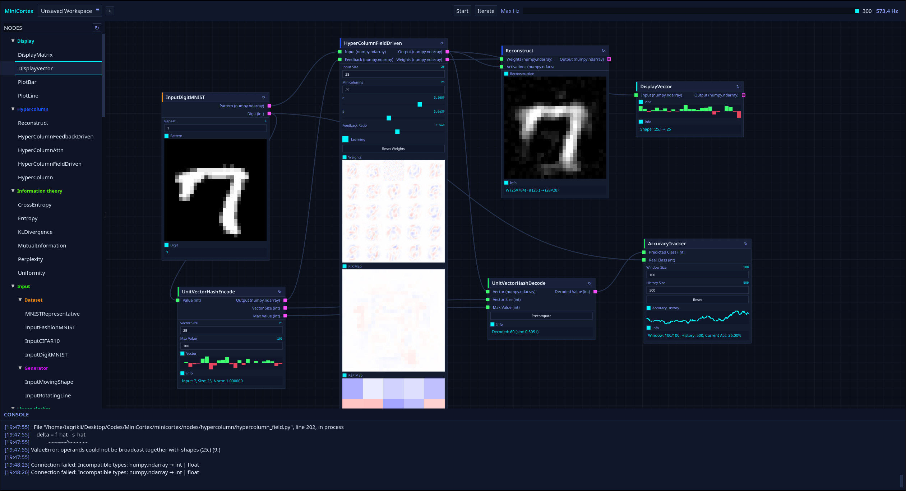

<p align="center">
  
</p>

<h1 align="center">MiniCortex</h1>

<p align="center">
  <strong>A node-based computational framework with a PySide6 visual editor</strong>
</p>

<p align="center">
  <em>Define modular computational units in Python, wire them together in a desktop editor, and watch them run — live.</em>
</p>

---

## Overview

MiniCortex is a **node-based simulation framework** paired with a **real-time PySide6 visual editor**. It lets you define computational units as modular Python classes, connect them into directed graphs, execute them with topologically-ordered signal propagation, and observe their internal states updating live in the desktop application — all without writing any UI code.

What defines MiniCortex:

- **Declarative node definition** — a Python descriptor API where inputs, outputs, properties, displays, actions, and persistent stores are declared as class attributes. No boilerplate; everything is accessed as `self.attribute_name`.
- **Live visual editor** — a PySide6 desktop canvas with drag-and-drop node composition, interactive property controls, and real-time 2D/1D array visualization rendered directly inside each node.
- **Topological execution engine** — a network runtime that sorts nodes by dependency (Kahn's algorithm), propagates signals in tick-based steps, and handles feedback cycles by using previous-tick values.
- **Hot-reloadable nodes** — all nodes support hot-reloading by default. Edit a node's Python source on disk and reload it in the running editor. State is preserved, invalid connections are pruned, and `init()` is called fresh.
- **Workspace persistence** — save and load entire graph configurations (nodes, connections, state, viewport) as JSON files, enabling reproducible experiments and session continuity.

---

## Key Concepts

### Nodes

A **Node** is the fundamental computational unit. Each node defines:

| Concept | Description |
|---|---|
| **Input Ports** | Typed connection points that receive data from upstream nodes |
| **Output Ports** | Typed connection points that send data to downstream nodes |
| **Properties** | Interactive parameters (sliders, integers, checkboxes, dropdowns) adjustable from the UI |
| **Displays** | Visual outputs rendered inside the node (2D/1D arrays, numeric values, text) |
| **Actions** | Buttons that trigger callbacks on the node instance |
| **Stores** | Persistent internal state variables that survive workspace save/load and hot-reload |

Nodes are defined as Python classes inheriting from `Node`, using a **descriptor-based declarative API**:

```python
import numpy as np
from minicortex.core.node import Node
from minicortex.core.descriptors.ports import InputPort, OutputPort
from minicortex.core.descriptors.properties import Range, Integer, Bool, Enum
from minicortex.core.descriptors.displays import Vector2D, Vector1D, Numeric, Text
from minicortex.core.descriptors.actions import Action
from minicortex.core.descriptors.store import Store
from minicortex.core.descriptors import branch

@branch("Processing")
class EdgeDetector(Node):
    """Applies a Sobel-like edge detection kernel to a 2D input."""

    # Ports — typed connection points
    input_image  = InputPort("Image", np.ndarray)
    output_edges = OutputPort("Edges", np.ndarray)

    # Properties — interactive controls in the UI
    threshold   = Range("Threshold", 0.3, 0.0, 1.0)
    kernel_size = Integer("Kernel Size", default=3, min_val=3, max_val=7)
    invert      = Bool("Invert", default=False)
    mode        = Enum("Mode", options=["fast", "accurate"], default="fast")

    # Displays — live visualizations rendered inside the node
    preview    = Vector2D("Preview", color_mode="grayscale")
    histogram  = Vector1D("Edge Histogram")
    edge_ratio = Numeric("Edge %", format=".1f")
    info       = Text("Status", default="Waiting for input")

    # Actions — buttons that call methods
    reset = Action("Reset Stats", callback="_on_reset")

    # Stores — persistent state that survives save/load and hot-reload
    frame_count = Store(default=0)

    def init(self):
        """Called once after registration."""
        self.frame_count = 0

    def process(self):
        """Called each network tick. Read inputs, compute, set outputs."""
        if self.input_image is None:
            return

        img = self.input_image.astype(np.float64)
        # Simple Sobel-like gradient magnitude
        gx = np.diff(img, axis=1, prepend=img[:, :1])
        gy = np.diff(img, axis=0, prepend=img[:1, :])
        magnitude = np.sqrt(gx**2 + gy**2)
        magnitude /= magnitude.max() + 1e-9

        # Apply threshold
        edges = (magnitude > float(self.threshold)).astype(np.float64)
        if self.invert:
            edges = 1.0 - edges

        self.frame_count += 1
        self.output_edges = edges
        self.preview = edges
        self.histogram = magnitude.mean(axis=0)
        self.edge_ratio = 100.0 * edges.mean()
        self.info = f"Frame {self.frame_count}"

    def _on_reset(self, params):
        self.frame_count = 0
        return {"status": "ok"}
```

All descriptor values are accessed directly as `self.attribute_name` — no boilerplate getters or setters.

### Node Categories

Nodes are organized into categories via the `@branch` decorator that auto-registers them in the UI palette:

```python
@branch("Input")           # Input nodes (data sources, generators)
@branch("Processing")      # Processing nodes (algorithms, learning rules)
@branch("Utilities")       # Utility nodes (transforms, displays, arithmetic)
@branch("Output")          # Output nodes (data sinks, exporters)
@branch("Custom/Category") # Hierarchical categories
```

### Network Execution

The **Network** engine processes the node graph using **Kahn's algorithm** for topological sorting, ensuring that:

- **Feedforward** inputs are always fresh (computed in the current tick).
- **Feedback** connections (cycles) receive values from the previous tick (t−1).
- Signals are cloned (numpy arrays are copied) to prevent aliased mutation.
- Any node error halts execution, broadcasts a detailed traceback to the UI, and highlights the offending node.

Execution can be:
- **Started/Stopped** — continuous loop at a configurable Hz (1–300 Hz).
- **Single-stepped** — advance exactly one tick for precise debugging.
- **Speed-controlled** — slider in the UI sets the target tick rate; actual Hz is measured and displayed.

### Hot Reload

All nodes support **hot-reloading at runtime**. When you click the reload button (↻) in the node header:
1. The Python module is reloaded from disk.
2. A new instance is created with the updated class definition.
3. **Store values** and **Property values** are preserved.
4. Invalid connections (referencing removed ports) are cleaned up.
5. `init()` is called fresh on the new instance.

This enables a tight edit → reload → observe loop without restarting the editor.

### Workspaces

The workspace system provides full session persistence:

- **Save** — serializes all nodes (type, position, properties, stores), connections, and viewport state to a JSON file.
- **Load** — deserializes and reconstructs the entire graph, restoring node state including numpy arrays stored via `Store`.
- **Clear** — resets to an empty canvas.
- **Workspace management** — save, load, and delete workspaces through the UI.

---

## Architecture

```
MiniCortex
├── minicortex/                 # Python backend
│   ├── core/                   # Core framework
│   │   ├── node.py             # Node base class + NodeMeta metaclass
│   │   ├── registry.py         # Global node & connection registries
│   │   └── descriptors/        # Declarative descriptor system
│   │       ├── base.py         # Property, Display, Action base classes
│   │       ├── ports.py        # InputPort, OutputPort descriptors
│   │       ├── properties.py   # Range, Integer, Bool, Enum
│   │       ├── displays.py     # Numeric, Vector1D, Vector2D, Text
│   │       ├── actions.py      # Action descriptor
│   │       ├── store.py        # Store (persistent state) descriptor
│   │       └── node.py         # @branch decorator + auto-discovery
│   ├── network/
│   │   └── network.py          # Topological execution engine
│   └── nodes/                  # Built-in node implementations
│       ├── input.py            # InputMovingShape, InputRotatingLine,
│       │                       #   InputDigitMNIST, InputFashionMNIST, InputInteger
│       ├── noise.py            # Noise generators
│       ├── utilities.py        # AddNoise, Invert, DisplayGrayscale, DisplayBWR,
│       │                       #   AddArrays, Duplicate, AddIntegers, MovingAverage2D
│       └── cortex.py           # Cortical processing models
├── minicortex_qt/              # PySide6 desktop interface
│   ├── main.py                 # Application entry point
│   ├── main_window.py          # Main window with menu, toolbar, canvas
│   ├── bridge.py               # Bridge between backend and UI
│   ├── computation_thread.py   # Background computation thread
│   ├── canvas/                 # Canvas rendering components
│   │   ├── editor_scene.py     # QGraphicsScene for node graph
│   │   ├── editor_view.py      # QGraphicsView with pan/zoom
│   │   ├── node_item.py        # Node UI representation
│   │   ├── port_item.py        # Port UI representation
│   │   └── connection_item.py  # Connection line rendering
│   ├── panels/                 # Side panels
│   │   └── palette.py          # Node palette panel
│   ├── dialogs/                # Dialog windows
│   │   └── save_workspace.py   # Workspace save/load dialogs
│   └── themes/                 # UI themes
│       └── dark.qss            # Dark theme stylesheet
├── data/                       # Datasets and media
│   └── media_github/           # Repository images
└── utils/
    └── download_mnist_datasets.py  # MNIST dataset download script
```

---

## Descriptor System

The descriptor system is the backbone of node definition. Each descriptor type is a Python **data descriptor** that manages instance-level state via `__get__`/`__set__`, collected at class creation time by the `NodeMeta` metaclass.

### Properties (Interactive Controls)

```python
# Continuous slider with optional log scale
alpha = Range("Learning Rate", 0.01, 1e-5, 1.0, scale="log")

# Integer input with optional bounds
count = Integer("Count", default=10, min_val=1, max_val=100)

# Boolean toggle
enabled = Bool("Enabled", default=True)

# Enum selection
mode = Enum("Mode", options=["fast", "accurate"], default="fast")
```

All properties support an `on_change` callback (method name string or callable) that fires when the value changes.

### Displays (Visual Outputs)

```python
# 2D array rendered as an image (grayscale or bwr colormap)
heatmap = Vector2D("Weights", color_mode="grayscale")

# 1D array rendered as a bar chart
bars = Vector1D("Activations")

# Scalar value with format string
loss = Numeric("Loss", format=".4f")

# Text string
info = Text("Status", default="Ready")
```

Displays can be individually toggled on/off in the UI to reduce visual clutter.

### Ports (Connections)

```python
# Typed input — accepts np.ndarray from upstream
input_data = InputPort("Input", np.ndarray)

# Typed output — sends int downstream
output_value = OutputPort("Value", int)
```

Port type compatibility is checked when creating connections. The `"any"` type accepts any data.

### Stores (Persistent State)

```python
# Persisted across save/load and hot-reload
angle = Store(default=0.0)
matrix = Store(default=None)
```

Store values are serialized to workspace JSON files (numpy arrays are converted to nested lists with a type marker for lossless round-tripping).

### Actions (Buttons)

```python
# Renders a button in the node UI; calls the named method on click
reinit = Action("Reinitialize", callback="_on_reinit")
```

---

## Getting Started

### Prerequisites

- **Python ≥ 3.12**
- **[uv](https://docs.astral.sh/uv/)** (recommended) or pip

### Installation

```bash
# Clone the repository
git clone https://github.com/your-username/MiniCortex.git
cd MiniCortex

# Install dependencies with uv
uv sync

# Or with pip
pip install -e .
```

### Download Datasets (Optional)

To use the MNIST and Fashion-MNIST input nodes:

```bash
python utils/download_mnist_datasets.py
```

This downloads the IDX files to `data/mnist/mnist/` and `data/mnist/fashion-mnist/`.

### Run

```bash
# With uv
uv run python main.py

# Or directly
python main.py
```

The PySide6 editor will launch with a dark theme by default.

### Quick Start

1. **Add nodes** — drag node types from the left-hand palette onto the canvas, or right-click for a context menu.
2. **Connect nodes** — click and drag from an output port (right side) to an input port (left side) of another node.
3. **Configure** — adjust sliders, integers, and other properties directly in the node body.
4. **Run** — press **Start** (or `Ctrl+Space`) to begin continuous execution. Use **Step** (or `Ctrl+Return`) for single-step.
5. **Observe** — watch 2D weight matrices, activation bar charts, loss values, and patterns update in real time.
6. **Save** — use the workspace menu to save your graph for later.

### Keyboard Shortcuts

| Key | Action |
|---|---|
| `Ctrl+Space` | Toggle network start/stop |
| `Ctrl+Return` | Single-step the network |
| `Ctrl+S` | Save workspace |
| Right-click | Delete selected node or connection |
| Middle-drag (canvas) | Pan the viewport |
| Scroll wheel | Zoom in/out (towards cursor) |
| Left-drag (node header) | Move a node |

---

## Creating Custom Nodes

Create a new Python file in `minicortex/nodes/` — it will be auto-discovered on startup.

```python
# minicortex/nodes/my_nodes.py

import numpy as np
from minicortex.core.node import Node
from minicortex.core.descriptors.ports import InputPort, OutputPort
from minicortex.core.descriptors.properties import Range
from minicortex.core.descriptors.displays import Vector2D
from minicortex.core.descriptors import branch

@branch("Experimental")     # Custom category in the palette
class MyNode(Node):
    """A custom node that scales its input."""

    input_data  = InputPort("Input", np.ndarray)
    output_data = OutputPort("Output", np.ndarray)
    scale       = Range("Scale", 1.0, 0.0, 10.0)
    preview     = Vector2D("Preview", color_mode="grayscale")

    def init(self):
        pass

    def process(self):
        if self.input_data is None:
            return
        result = self.input_data * float(self.scale)
        self.output_data = result
        self.preview = result
```

If the editor is already running, click the **↻** (rediscover) button in the palette to pick up the new node without restarting.

---

## Dependencies

| Package | Purpose |
|---|---|
| **numpy** | Array computation and signal processing |
| **PySide6** | Qt6-based desktop UI framework |
| **python-mnist** | MNIST / Fashion-MNIST dataset loader |
| **scikit-learn** | Machine learning utilities |

---

## License

This project is provided as-is for research and experimentation purposes.
