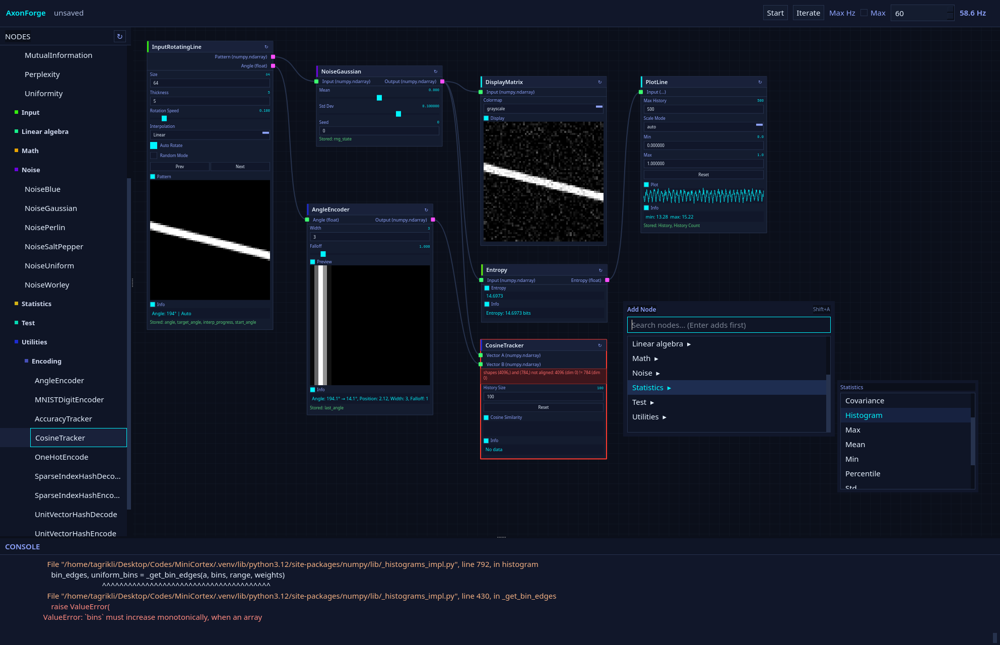

<p align="center">
  
</p>

<h1 align="center">AxonForge</h1>

<p align="center">
  <strong>A node-based computational framework with a PySide6 visual editor</strong>
</p>

<p align="center">
  <em>Define computational nodes in Python, connect them visually, and run the graph live.</em>
</p>

---

## Overview

AxonForge is a desktop node editor and runtime for building computational graphs.

Core ideas:

- Declarative node classes using descriptors (`InputPort`, `OutputPort`, `Range`, `Store`, etc.)
- Real-time PySide6 graph editor
- Topological network execution with runtime error reporting
- Project-based persistence (`project.json` + `data/` array files)
- Hot reload for dynamic nodes

---

## Core Capabilities

- **Project workflow**
  - `File -> New Project`, `Load Project`, `Save Project`, `Recent Projects`
  - project name derived from folder name
- **Persistence**
  - graph, properties, stores, viewport, and editor UI state are saved in project data
  - numpy arrays are persisted in `data/*.npy` and referenced from `project.json`
- **Runtime**
  - topological execution with single-step and continuous run modes
  - configurable max Hz (`1..1000`) plus unthrottled `Max` mode
- **Node lifecycle**
  - optional process-based `@background_init` with loading overlay
  - hot reload support for dynamic nodes
- **Diagnostics**
  - init/process errors shown both in console and directly on node UI
- **Editor interaction**
  - searchable quick-add (`Shift+A`) with cascading categories
  - active/new node bring-to-front behavior
  - connections are hover-highlighted and right-click deletable (not selectable)
  - drawer/console resize preserves canvas screen position

---

## Installation

### Prerequisites

- Python 3.12+
- Linux/macOS/Windows with Qt support for PySide6

### Install

```bash
git clone https://github.com/your-username/MiniCortex.git
cd MiniCortex

# using uv
uv sync

# or using pip
pip install -e .
```

---

## Run

```bash
# preferred module entry
python -m axonforge_qt.main

# or installed script (from pyproject)
axonforge-qt
```

Startup log should end with:

```text
AxonForge ready.
```

---

## Quick Start

1. Create or load a project folder from the **File** menu.
2. Add nodes:
   - drag from drawer, or
   - press `Shift+A` and search.
3. Connect ports by drag.
4. Set node properties in-node.
5. Start network with `Ctrl+Space` or step with `Ctrl+Return`.
6. Save project with `Ctrl+S`.

---

## Controls

| Shortcut / Action | Behavior |
|---|---|
| `Ctrl+Space` | Start/stop network |
| `Ctrl+Return` | Single network step |
| `Ctrl+S` | Save project |
| `Shift+A` | Open quick-add node picker |
| `Shift+D` | Duplicate selected node(s) |
| `Shift+R` | Toggle drawer |
| `Shift+T` | Toggle console |
| Right-click node | Delete node |
| Right-click connection | Delete connection |
| Mouse wheel | Zoom |
| Middle mouse drag | Pan |

---

## Defining Nodes

Nodes are normal Python classes inheriting from `Node`.

```python
import numpy as np

# Base node class and optional background init decorator
from axonforge.core.node import Node, background_init
# Category registration for palette/quick-add
from axonforge.core.descriptors import branch
# Connection endpoints
from axonforge.core.descriptors.ports import InputPort, OutputPort
# Editable parameters shown in node UI
from axonforge.core.descriptors.properties import Range, Integer, Bool, Enum
# Read-only output views shown in node UI
from axonforge.core.descriptors.displays import Vector2D, Text
# Button action descriptor
from axonforge.core.descriptors.actions import Action
# Persisted internal state (saved with project)
from axonforge.core.descriptors.store import Store


@branch("Demo/Examples")
class ExampleNode(Node):
    # Ports: receive/send graph data
    x = InputPort("X", np.ndarray)
    y = OutputPort("Y", np.ndarray)

    # Properties: user-editable controls in the node
    gain = Range("Gain", 1.0, 0.0, 5.0)
    steps = Integer("Steps", 1)
    enabled = Bool("Enabled", True)
    mode = Enum("Mode", ["a", "b"], "a")

    # Displays: visual outputs rendered in the node body
    preview = Vector2D("Preview")
    info = Text("Info", default="ready")

    # Action button: calls _reset when clicked
    reset = Action("Reset", callback="_reset")

    # Store: persistent value saved/loaded with project
    counter = Store(default=0)

    # Optional: run in background worker process
    @background_init
    def init(self):
        self.counter = 0

    def process(self):
        if self.x is None or not self.enabled:
            return
        self.y = self.x * float(self.gain)
        self.preview = self.y
        self.counter += 1
        self.info = f"ticks={self.counter}, mode={self.mode}"

    def _reset(self, params=None):
        self.counter = 0
```

Current workflow for custom nodes in this repo: place node files under `axonforge/nodes/...` and rediscover from the drawer refresh button.

---

## Project File Format

Each project folder contains:

- `project.json`
- `data/` (for persisted arrays)

`project.json` includes:

```json
{
  "version": 4,
  "kind": "project",
  "project_name": "my_project",
  "viewport": {
    "pan": {"x": 12.3, "y": -45.6},
    "zoom": 1.2
  },
  "editor": {
    "drawer_collapsed": true,
    "drawer_width": 260,
    "console_collapsed": false,
    "console_height": 220,
    "max_hz_enabled": false,
    "max_hz_value": 60
  },
  "nodes": [...],
  "connections": [...]
}
```

Arrays are stored as `.npy` and referenced from node data.

---

## Console and Logging

- Console lines are prefixed with `<user>@<project> >` (or `!>` for error stream).
- No per-line timestamp prefixing.
- Multi-line tracebacks are colorized by line type.

---

## Caching and Config Paths

- App config (recent projects): Qt GenericConfigLocation under `AxonForge/settings.json`
- Dataset cache (MNIST preprocessed arrays): Qt GenericCacheLocation under `AxonForge/datasets/`

---

## Runtime Notes

- Network execution uses topological ordering with cycle fallback semantics.
- Signals are passed by reference (no defensive clone in runtime).
  - Avoid in-place mutation of shared input objects unless intended.
- Process errors stop the network and mark failing nodes.

---

## Architecture (Current)

```text
axonforge/
  core/
    node.py
    registry.py
    descriptors/
  network/
    network.py
  nodes/
    ... built-in node modules ...

axonforge_qt/
  main.py
  main_window.py
  bridge.py
  computation_thread.py
  canvas/
  panels/
  themes/
```

---

## Roadmap Direction

Planned direction discussed in development:

- Keep AxonForge app/framework separate from user project code
- Allow project-local custom node files loaded from project folders
- Maintain stable SDK-style imports for user-authored nodes

---

## License

Provided as-is for research and experimentation.
